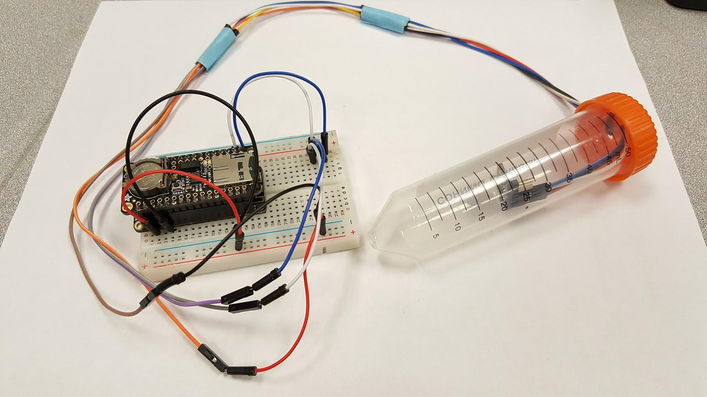

# Temp Monitor with Data Logger

This repo contains the necessary Arduino code to run a temperature monitoring project using Adafruit hardware and IoT interface.

# Hardware

This project uses hardware used mostly from Adafruit.com.

-Assembled Feather HUZZAH w/ ESP8266 WiFi With Stacking Headers
[https://www.adafruit.com/product/3213]

-Adalogger FeatherWing - RTC + SD Add-on For All Feather Boards
[https://www.adafruit.com/product/2922]

-MCP9808 High Accuracy I2C Temperature Sensor Breakout Board
[https://www.adafruit.com/product/1782]

